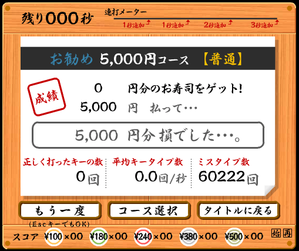

# 寿司打のミスタイプ数を稼ぐプログラムを作ろう

[寿司打](http://typing.sakura.ne.jp/sushida/)のおすすめコースでできるだけミスタイプ数を多くする．

## 手動

左右の指を4本ずつ使い，左手は `asdf` ，右手は `hjkl` を連打するのが最速の模様．

最高記録4243回．

## 自動

連打ツールでMacで動くものが見当たらなかったので，Pythonで自分で作ってみる．

### 導入

pyautoguiというパッケージでキーボード操作ができる．

```python
import pyautogui as pgui
pgui.typewrite('Hello, World!')
```

ミスタイプ数を稼ぐためには， `while(True)` の中に， `pgui.typewrite` を入れてやると良い．

```python
import pyautogui as pgui
while(True):
  pgui.typewrite('a')
```

このプログラムを実行している間に寿司打をスタートすれば，あとは自動でやってくれる．

ミスタイプ数684回．

`while(True)` の評価がボトルネックになっている模様．

## 改良編

### ボトルネックの解消

`while(True)` の評価回数をできるだけ少なくするため， `pgui.typewrite` の中身の文字列を長くする．

```python
str = "asdfghjkl" * 10000
while(True):
    pgui.typewrite(str)
```

ミスタイプ数3693回．

### 並列化

単一のプロセスにおける実行ではこれ以上のミスタイプは望めないため，並列化することでさらなる高速化を試みる．

一つのプロセスでは90秒間に3700回程度のミスタイプが限界であると考えられるため， `while(True)` で無限ループでミスタイプをし続けなくとも，1プロセスあたり4000回程度ミスタイプをさせれば，おすすめコースの90秒間ミスタイプし続けることが可能であると考えられる．

#### concurrent.futuresを用いた並列化（失敗）

```python
import pyautogui as pgui
import concurrent.futures

misstype = "a" * 4000
misstypes = [misstype for _ in range(5)]

def sushida(arg):
    pgui.typewrite(arg)
    return 0

if __name__ == '__main__':
    with concurrent.futures.ProcessPoolExecutor() as executor:
      for _ in executor.map(sushida, misstypes):
        pass
```

結果...

```
The process has forked and you cannot use this CoreFoundation functionality safely. You MUST exec().
```

どうやらpyautoguiはこの方法では並列化できないようだ．

#### asyncioを用いた並列化（失敗）

```python
import pyautogui as pgui
import asyncio

async def sushida(arg):
    pgui.typewrite(arg)
    return 0

loop = asyncio.get_event_loop()
loop.run_until_complete(asyncio.gather(
    sushida("a" * 4000),
    sushida("b" * 4000),
    sushida("c" * 4000),
))
```

結果...

```
bbbbbbbbbbbbbbbbbbbbbbbbbbbbbbbbbbbbbbbbaaaaaaaaaaaaaaaaaaaaaaaaaaaaaaaaaaaaaaaacccccccccccccccccccccccccccccccccccccccc
```

非同期で動かすこと自体は成功したが， `b` の入力が終わってから `a` の入力が始まり，それが終わってから `c` の入力が始まっているので，並列で動作させることはできていない．

#### subprocessを用いた並列化

引数で指定した文字を4000回入力するという簡単なプログラムを用意した．

```python
# renda.py
import sys
import pyautogui as pgui

misstype = sys.argv[1] * 4000
pgui.typewrite(misstype)
```

これを，ターミナルで4個同時に動作させたところ，ミスタイプ数14588回というスコアを記録した．

そこで， `subprocess.Popen` を使用してプログラムを同時に複数個動作させるプログラムを用意した．

```python
import subprocess

misstypes = "a b c d".split(" ")

for i in misstypes:
    subprocess.Popen(["python", "renda.py", i])
```

これを使用して，同時に動作させるプログラム数を変えていったところ，ミスタイプ数は以下のように変化した．

|プログラム数|ミスタイプ数|
|:---:|:---:|
|4|14588|
|5|18420|
|8|29950|
|10|36847|
|12|45420|
|16|60222|
|20|34779|



プログラム数16くらいまではミスタイプ数が線形に伸びていることがわかる．  
使用したコンピュータは2コア4スレッドなのだが，なぜこのような結果になるのだろうか...

## 余談


ローマ字で使用するアルファベットをすべて並列で連打させることで，ミスタイプ数だけでなく皿の数も稼ぐことが可能である．  
これにより，おすすめコースで22740円というスコアを記録した．
